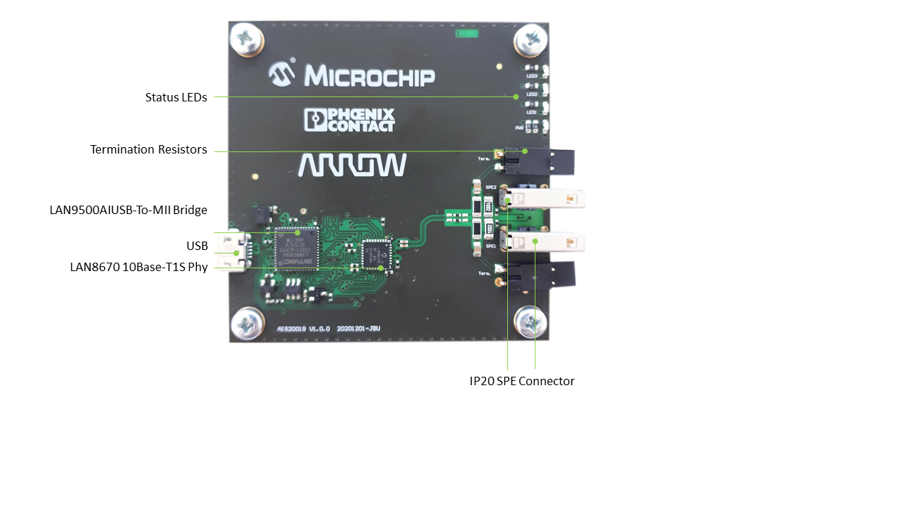

# Fast Track to Single-Pair-Ethernet enabled products with Arrow, Microchip & Phoenix Contact
Product: USB-To-10Base-T1S Kit - (Manufactured by Trenz Electronic GmbH)

Drop me an email if you want to test this board it will be available on Arrow Testdrive soon: jpiwek@arroweurope.com

**10BASE-T1S-to-USB Bridge** - [Link](https://)
====================================================

**Story - New Ethernet PHYs Enable Multidrop Bus Architecture, Enhancing Industrial Networks’ Scalability and Functionality**
------------------------
Arrow along with key partners in this sector, have developed a unique plug and play USB-To-Single Pair Ethernet Evaluation Kit. This kit is suitable for end applications such as Embedded PCs, Single Board Computers as well as Industrial applications to communicate SPE (10Base-T1S) and for fast evaluation of 10Base-T1S Multidrop Technology.
10BASE-T1S refers to a 10 Mbit/s shared connection. It uses half-duplex data transmissions. Up to 50 nodes, depending on the environment, can be connected with a minimum 25m bus length. The technology is being developed as the IEEE 802.3cg standard, which envisions low power physical layer transceivers and a bus line connection without collisions

Kit Deliverables:
  - [*LAN867x: 10Base-T1S Phy*](doc/00003919.pdf)
  - [*LAN9500AI: Single-chip, Hi-Speed USB 2.0 to 10/100 Ethernet controller*](https://www.microchip.com/wwwproducts/en/LAN9500A#additional-features)
  - [*IP20*: Phoenix Contact IEC63171-2 Connector](https://www.phoenixcontact.com/online/portal/at?1dmy&urile=wcm%3Apath%3A/atde/web/main/products/technology_pages/subcategory_pages/Single_pair_ethernet/52214e58-5f89-4493-b2fa-96873d7e97c3)
  - 1m SPE cable 1207744
  

**Reliable and secure sensor-to-cloud communication **
------------------------
SPE enables continuous IP communication between server and cloud as well as power supply in complex IIoT solutions. SPE represents the next milestone in network technology and will revolutionize the market. 
Single Pair Ethernet is the extension of Ethernet technology into sensor technology. SPE 10Base-T1S technology is compact, flexible, and enables edge nodes to be connected using multidrop/bus topology which eliminates expensive industrial infrastructure like switches. SPE allows the extension of existing installations and supports consistent communication based on the Ethernet protocol. 

 **Target Markets / Use-Cases**
------------------------
  - Industrial Automation (Replace FieldBus, RS485, EtherCAT, Ethernet point-to-point)
  - Building Automation (Replace legacy “home grown” connections, Ethernet point-to-point, Lighting, Intercom, A/C, Window Shades, Elevators, etc.)

**Schematic**
------------------------
[*Download*](doc/Schematic_AIS20019_10BASE-T1S_USB_Interface_Phoenix_Contact_V1.0.0.PDF)

**Examples**
------------------------
All examples are built with ???. Those give you a good starting point for your own projects.
  - "Getting Started for Windows": [Go to example](https://github.com/jpiwek/usb_t1s_bridge/tree/main/software/install/README.md)
  - "Getting Started for Linux": Coming soon

To install drivers for Windows and Linux systems, please go [here](https://github.com/jpiwek/usb_t1s_bridge/tree/main/software/install/README.md)

**Details**
------------------------

