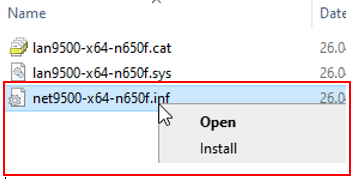
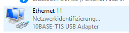
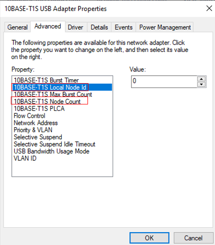

**USB-To-10Base-T1S Kit** - [Link](https://)
====================================================

# Software and Driver Installtion

## Introduction
This folder contains details about software / drivers for the USB-To-10Base-T1S Kit board.

 ## [Installtion Windows](https://github.com/jpiwek/trustify/tree/master/software/example/win_install)

1. Download and extract Windows Driver: [Link](driver/Windows_Driver_DRAFT.zip)
2. To install the driver right click on "net9500-x64-n650f.inf" and "Install" 

3. Go to Control Panel -> Network and Internet ->Network Connections to configure the LAN876x Phy

* if the driver in "Step 1" was properly installed, a new "10Base-T1S USB Adaptor" Ethernet interface is listed  

4. Now lets set up T1S specific settings for the PLCA Coordinator (Node ID 0) Node
* Set 10BASE-T1S Local Node Id: 0
* Set 10BASE-T1S Node Count: e.g. 4 (describes how many T1S device will be deployed on the Multidrop Bus)

6. 
7. 
8. Configure TCP/IP v4 setting by clicking

  ## [Installtion Linux](https://github.com/jpiwek/trustify/tree/master/software/example/linux_install)

Lorem Ipsum

## The End
