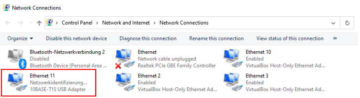

**10BASE-To-T1S Bridge Kit** - [Link](https://)
====================================================

# Software and Driver Installtion

## Introduction
This folder contains details about software / drivers for the USB-To-10Base-T1S Kit board.
This document describes the usage of the 10BASE-T1S-To-USB Media Converter with Windows and Linux operating systems.
The board utilizes a Microchip LAN9500A to provide access to the 10BASE-T1S PHY LAN8670 via USB.

 ## [Installation Windows](https://github.com/jpiwek/trustify/tree/master/software/example/win_install)

1. Download and extract Windows Driver: [Click here](../../driver/Windows_Driver_DRAFT.zip)
2. To install the driver right click on "net9500-x64-n650f.inf" and "Install" 

3. Go to Control Panel -> Network and Internet ->Network Connections to configure the LAN876x Phy

* if the driver in "Step 1" was properly installed, a new "10Base-T1S USB Adaptor" Ethernet interface is listed  

4. Now lets set up T1S specific settings for the PLCA Coordinator (Node ID 0) Node
* Set 10BASE-T1S Local Node Id: 0
* Set 10BASE-T1S Node Count: e.g. 4 (describes how many T1S device will be deployed on the Multidrop Bus)

8. Configure TCP/IP v4 settings


  ## [Installation Linux](https://github.com/jpiwek/trustify/tree/master/software/example/linux_install)

1. The available Linux driver for 10BASE-T1S-To-USB media converter was tested on Raspberry PI 4 with Linux kernel 5.10.17-v7l.
2. Download and extract Linux Driver: [Click here](../../driver/20210730_Linux_10Base_T1S_To_USB.tar.gz)  
3. Untar Linux compressed tar.gz archive 

    ```tar xzvf 20210730_Linux_10Base_T1S_To_USB.tar.gz```
  
4. go to "t1s_20210730" folder and execute make

    ```cd t1s-usb_20210730/ && make```
  
5. Now lets set up T1S specific settings for the PLCA Coordinator (Node ID 0) Node
  The driver kernel objects lan8767x_phy.ko and smsc95xx_t1s.ko were built.
  Now please attach the 10BASE-T1S USB Adapter to your Linux device.
  To load the driver you can use the script file t1s.sh with the node ID (0..7) as parameter. It makes a new Ethernet Interface available "eth1"

   5.1 Load driver for T1S Master with ID "0":
  
     ```sudo ./t1s.sh 0 ```
   
   5.2 Load driver for T1S Slave with ID "1..7":
  
     ```sudo ./t1s.sh 1 ```
  
 6. By default an IP address if pre-configured by the t1s.sh script: 192.168.0.1x -> x=['Node ID'] 0..7
   This is the console message you see if everything was set properly
  ```
  Configure 10BASE-T1S adapter as node 0:
    Removed drivers:
    lan867x_phy            16384  0
    -
    Present drivers:
    smsc95xx_t1s           32768  0
    lan867x_phy            16384  1
    MCHP 10BASE-T1S adapter found.
            inet 192.168.0.10  netmask 255.255.255.0  broadcast 192.168.0.255
  Done.

  ```

## The End
